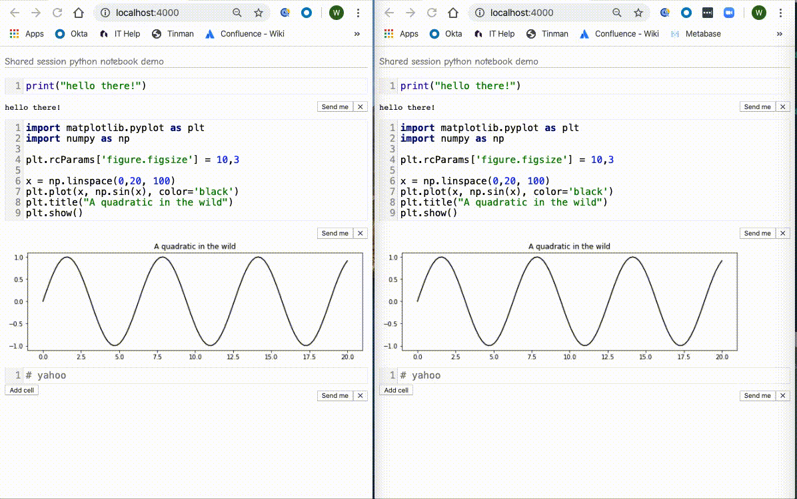

# SimplePythonNotebook

## What's this?

A collaborative python notebook service, written in elixir.

## Usage

To start your Phoenix server:

  * Install dependencies with `mix deps.get`
  * Create and migrate your database with `mix ecto.setup`
  * Install Node.js dependencies with `cd assets && npm install`
  * Build dependencies with `rollup -c `
  * cd back to the root directory
  * Start Phoenix endpoint with `mix phx.server`
  * Install any python libaries you want to have access to. I recommend using a venv.

Now you can visit [`localhost:4000`](http://localhost:4000) from your browser.

